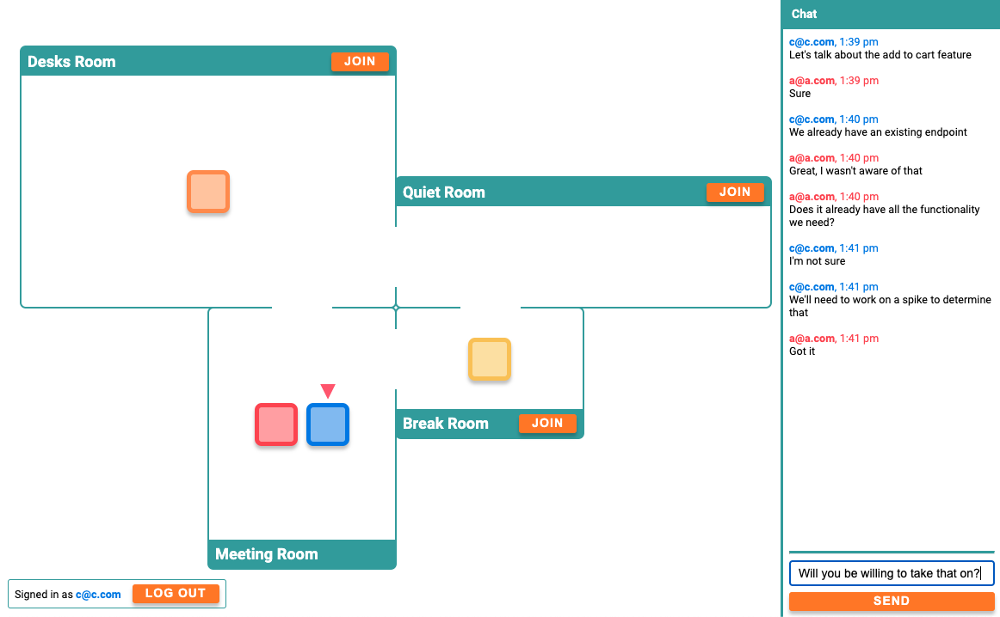

# Virtual Office



## Prerequisite Installations

-   Node
-   MongoDB

## How To Run

### Download dependencies

Clone repo and download dependencies:

```
npm install
```

### Prepare .env file

Create a dev `.env` file in the repo root like so:

```
NODE_ENV=development
PORT=8000
SESSION_SECRET=penguinmonkey
DB_PATH=mongodb://localhost/virtualOfficeDev
```

### Build Code

```
npm run all:build
```

### Start server

```
npm run start
```

Access web app at [http://localhost:8000/](http://localhost:8000/) (or whatever port you set in the .env).

## Useful Development Commands

Please see the package.json for all the build commands. The below list is a selected subset of those.

### Build server only

```
npm run server:build
```

### Build client only

```
npm run client:build
```

### Reinit database

Build the server

```
npm run server:build
```

Run DB script

```
npm run db:reinit
```

### Run linting

Prettier

```
npm run all:prettier:check
```

ESLint

```
npm run all:lint
```
